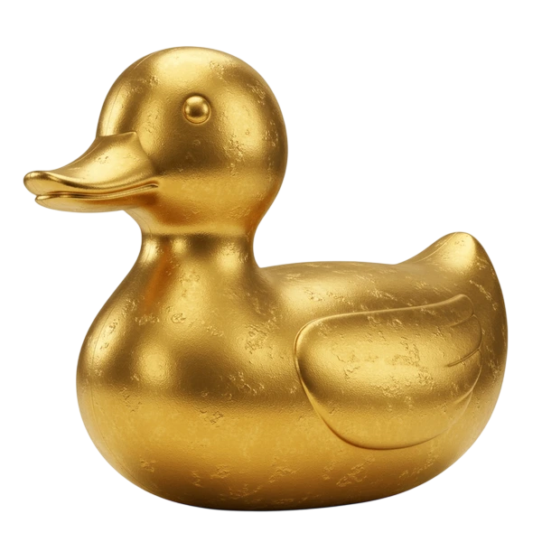

# Devlog 1

Fiz esse blogzinho só pra brincar um pouco de escrever como eu fazia antigamente.
Vou escrever aqui completamente sem planejar/pensar, realmente é só pra ser um hobby e de alguma maneira tentar fazer uma rotina legal de acompanhamento dos meus projetos de hobby/profissionais caso eu poste aqui.

---
Enfim, vou ver como as coisas funcionam 

O teste de imagem aí, queria que fosse uma imagem simbólica mas foi literalmente a imagem que usei com meus amigos pra fazer o pato de ouro

## Funcionalidades
O site (se você ainda não percebeu) foi quase todo feito por vibe coding, especialmente o front (mexer com git é fácil entt né).

Fico sim meio incomodado de vibecodar algo, mas como é simplesmente para diversão, não vejo pq não fazer.

Usei astro e TS pro site, mas acho melhor vc visitar o repostório do git se quiser saber mais sobre as coisas.

enfim, funcionalidades:

- Escrever, postar, editar e excluir posts
- Tags e busca por tags
- Arquivo para visualizar tudo posto no site
- Visualizar todos os posts como .md

---

Enfim, vamos ver depois se isso vinga.

Inclusive, pode ser que eu poste minhas histórias aqui quem sabe.
